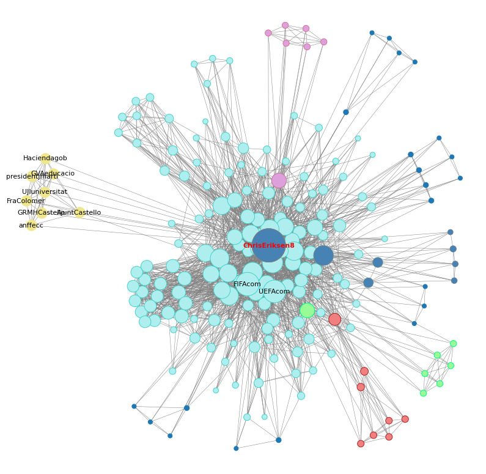

# Local Community Detection
 
## Task
 
Comparison of different local communities (“starting from seeds”) detection approaches. 
In this project, Overlapping Seed Set Expansion, LEMON, and MULTICOM, namely three of the most popular algorithms in this field, are applied to a dataset consisting of Twitter conversations related to the football event EURO2020.
 
## Theoretical background
 
It would be lecit to ask why local communities detection approaches made their appearance and gained popularity in the last decade. The answer is that local methods were compared to state-of-the-art global algorithms, and proved to be preferable for multiple reasons. For example, time complexity represents a crucial aspect when dealing with a big amount of data [1]. Sometimes it is indeed possible a global algorithm requires definitely too much time to be fully processed that results are not even returned.
 
Local communities detection approaches are not supposed to scan the whole network instead. They just consider a few, important nodes, called “**seeds**”, which are then fundamental to the identification of communities (communities are strictly dependent on the choice of seeds in this case). This solution guarantees less computation and a faster access to results.
 
Once the seed set is obtained, another key element of local community detection approaches is represented by the **seed set expansion**. This process consists of gradually growing the seeds into larger sets until target **communities** are revealed. It ensures a certain degree of sensitivity to the context. Since every seed can be expanded independently and thus the expansion can be parallelized, this represents another advantage with respect to traditional methods [3].  
 
For instance, random walk technique has been extensively adopted as a subroutine for locally growing the seed set [1].   

Another of the reasons why local methods are a good alternative is represented by their ability to overcome the resolution limit present in traditional methods based on modularity maximization. 

**Evaluation metrics** were applied by researchers during their experiments in order to validite communities obtained by using the two families of approaches.
 
In this sense, seed-centric solutions may give notably better results in terms of minimum conductance and F1-score, as remarked in the paper of Whang et al. [3]. Conductance defines the goodness of the community found by the algorithm around a seed set, while F1 is an indicator for the method’s accuracy. 
 
Normalized mutual information (NMI) is another index specific to community evaluation that could be taken into account. It turned out in favour of seed-centric approaches in a few experiments [2]. More consistent results should be obtained with larger datasets though.  
 
Anyway, these methods are not free from drawbacks. For instance, one of them is represented by the possibility of not covering all the nodes in a network when communities are discovered [2]. But, solutions were found such as adding outliers nodes to the most near community as proposed in the paper by Whang et al. [3].
 
All in all, these approaches are worth to be assessed when it comes to very large networks.   
 
## Dataset
 
The dataset consists of Twitter conversations related to EURO2020. 
 
Data were retrieved prior to the start of the project and are stored into a PostgreSQL server. 
The database consists of four major tables:
 
|  node | 	   |      |
|----|------|------|
| id | txt  | typ |
| integer | character varying | smallint |

1) It consists of the keyword contained in a tweet and its corresponding unique id.

| node_type |      |
|----|------|
| id | description |
| smallint | character varying |
 
2) It determines whether a node corresponds to an hashtag or to a user.

| edgestream |         |         |          |
|----------------|---------|---------|----------|
| timestamp_s    | node_1  | node_2  | typ      |
| integer        | integer | integer | smallint |
 
3) It includes the exact time when the tweet was published.  Plus, it defines co-existence of nodes in the same tweet and their relationship.

| edge_type |                   |          |             |             |
|---------------|-------------------|----------|-------------|-------------|
| id            | description       | directed | node_type_1 | node_type_2 |
| smallint      | character varying | boolean  | smallint    | smallint    |

4) It describes the possible relationship between nodes.

In this research, subsets based on **co-occurring hashtags** (edge_type id=1) and **co-occurring mentions** (edge_type id=4) are separately taken into consideration.
## Algorithms
 
Among the most successful algorithms for the detection of local communities, one can find Overlapping Seed Set Expansion (OSSE) [3], a local spectral approached called LEMON [4] and MULTICOM [5]. The latter is the most recent among the mentioned three.
 
Here is the description of their key characteristics and of their main advantages.

**Overlapping Seed Set Expansion (using Graclus Centers and Spread Hubs)**
This approach optimizes the conductance community score, by using a seed set expansion approach. The key idea is to find good seeds, and then expand these seed sets using the personalized PageRank clustering procedure.
 
Advantages: they guarantee faster overlapping community detection in runtime, a good conductance-vs-coverage ratio (low conductance and high coverage), and viable ground-truth accuracy.
 
**LEMON (Local Expansion via Minimum One Norm)**
It consists of a method for finding overlapping communities by seeking a sparse vector in the span of local spectra where the seeds are in its support. It includes a novel method to construct the local spectra based on the singular vector approximations drawn from short random walk [4].
 
Advantages: LEMON can achieve the highest detection accuracy among state-of-the-art proposals, and the running time depends on the size of the community rather than that of the entire graph.
 
**MULTICOM** 
It is an algorithm for detecting multiple local communities, possibly overlapping, by expanding the initial seed set [5].
This algorithm uses local scoring metrics to define an embedding of the graph around the seed set. Based on this embedding, it picks new seeds in the neighborhood of the original seed set, and uses these new seeds to recover multiple communities.
 
Advantages: the volume of information collected in the neighbourhood of the seed set by this multiple communities approach is important. In terms of performance it doesn’t seem to differ very much from the other presented methods.
 
Considering that all these algorithms performed remarkably well in experiments when compared to the other community detection algorithms, the main task of this project is to evaluate their performance on the considered subsets.
 
## Analysis

The whole analytical process is performed by using Python.
The algorithm implementation is possible by means of the library **CDlib** [6], which contains all the major algorithms developed for community detection in complex networks.
 
The library **psycopg2** then guarantees to work with the EURO2020 dataset in Python environment by performing normal SQL queries.

Queries are so performed to obtain two different subsets of the data: one containing only **co-occurring hashtags** and one containing only **co-occurring mentions**. This choice is made to see whether the algorithms performances are dependent on the nature of the Twitter dataset or not.

For each subset, a simple graph is generated using the library **networkx**. The co-occurring hashtags network holds less nodes (262.436 compared to 332.481), more links (3.429.695 compared to 1.640.209) and is denser (average degree is 26 compared to 10) than the co-occuring mentions network.

Two different starting seed nodes are subsequently chosen for the local community detection part. 
The **first seed node** is represented by the Italian footballer Leonardo Bonucci, named man of the match after the final between Italy and England. The **second seed node** corresponds to the Danish footballer, Christian Eriksen, who suffered an heart attack during the match Denmark-Finland. 

Both players have been selected because they made the history of the competition. Again, the double choice is made to highlight relevant differences related to the algorithms implementation, if any. 
**Subgraphs** containing data referring to a timeframe of 24 hours are considered for each key event in order to detect communities strictly related to the seed node.  

Considering that three is the number of local approaches adopted in this study, a total of twelve different settings is analysed.

### Algorithm comparison

|                                 | OSSE          | LEMON       | MULTICOM    |
|---------------------------------|---------------|-------------|-------------|
| Computational time              | <5 seconds    | <91 minutes | <18 minutes |
| Number of parameters*           | 8             | 6           | 0           |
| Number of communities detected  | 1             | 1           | 1+5         |
| Community size (range)          |190-3.000 nodes|10-50 (adjustable)|9-5.000 nodes|
| Interpretability of the results | Fair          | Good        | Good        |

\* other than "*g_original*" and "*seeds*"

This table shows a comparison of the algorithms performances. 

Overall, OSSE corresponds to the fastest approach and to the most flexible one (note that all the algorithms are run keeping their default parameters). In this regard, MULTICOM implementation is very rigid. 
On the other hand, this method detects 6 overlapping communities (this value is given as default) and offers more complete results. 

Nevertheless, LEMON is the only approach giving the possibility to manage the resulting community size.

At the level of interpretability, communities obtained by LEMON are all good. MULTICOM returns the best communities, but just in the case of co-occurring hashtags. Considering co-occurring mentions indeed, communities returned are too wide.    
### Results

Below, the most significant three contributions are presented.

- **MULTICOM co-occurring hashtags**

<figure>

<figcaption align = "left" style="font-size:1.1em"><i>Fig.1 - Community obtained by running MULTICOM (seed node: Bonucci)</i></figcaption>
</figure>

In this plot, it is possible to see that nodes such as "Shaw", "Donnarumma", "Chiellini" have a high relevance in the community. They are, respectively, the player who scored the only goal in the regular time for England (like Bonucci for Italy), the elected Player of the Tournament and the Captain of Italy. 
Other nodes highlighted among the most influential refer to a traditional Turkish sport (Yağlı güreş) and to a related festival occurring in Turkey on the same date of the final.     

<figure>

<figcaption align = "left" style="font-size:1.1em"><i>Fig.2 - Community obtained by running MULTICOM (center node: Chiesa)</i></figcaption>
</figure>

This other plot shows one of the five communities detected in the second loop of the algorithm. In here, the center node (namely the node with the highest degree acting as new seed node) is Chiesa, one of the top player of the Italian football team. In the community are present many Italy team members, and a few European players who played EURO2020.

The other communities have as center node Rashford, italya, Kane and DavidBeckham. Hashtags detected are inherent to England team members, events occurring on the same date, Turkish politics and cryptocurrencies and English celebrities and landmarks. 

- **LEMON co-occurring hashtags**

<figure>

<figcaption align = "left" style="font-size:1.1em"><i>Fig.3 - Community obtained by running LEMON (seed node: eriksen)</i></figcaption>
</figure>

This plot again displays a community containing co-occurring hashtags. However, LEMON approach does not work well if the detection is run on a simple graph. Many nodes in the detected community share the same information (like "DEN", "Den", "FIN", "Fin", referring to the teams involved in the match), and this happens because the method is not able to recognize words havin the same meaning but different letter case.

To obtain more interpretable results (as shown in the picture), the solution consists into converting words contained in the subset into lower case and then run the algorithm on a multigraph. What finally emerges is that hashtags with a broad meaning are still captured because they correspond to the most used hashtags and to nodes with the highest number of connections among themselves. But now, also more specific hashtags such as "prayforeriksen", "getwellsoon" and "respect" appear in the community.   

- **OSSE co-occurring mentions**

<figure>

<figcaption align = "left" style="font-size:1.1em"><i>Fig.4 - Community obtained by running OSSE (seed node: ChrisEriksen8)</i></figcaption>
</figure>

This last plot underlines the limit of Overlapping Seed Set Expansion. The resulting community contains about 600 nodes, and most of them are very low-degree nodes corresponding to not relevant users. 

To get rid of them and to learn more about the subcommunities that are visible, it may turn useful to apply a second step of community detection. Since the network is not significantly big anymore, it is possible to run traditional methods like the Louvain, the Greedy or the K-clique algorithm and to get back results in a short time. 

Not every subcommunity obtained offers a remarkable interpretation. Yet, one of them is identical to a community also detected by the LEMON algorithm.
Interestingly, it corresponds to a set of Twitter profiles linked to the city of Castellò (Spain). And this set includes the City Hall, a University and the Secretary of Tourism of the city among others.  
As provided by this example, Local Community Detection algorithms could spot real communities of users that take such events as a chance to promote their social brand.

## Conclusion and future works

This research has been conducted to provide a comparison of three local community detection approaches and to assess their implementation on a specific dataset.

Results are specifically evaluated in terms of interpretability. In this sense, LEMON and MULTICOM return interesting results, with the exception of the co-occurring mentions subset (MULTICOM) which, like OSSE, contains wide and not relevant local communities. 

Both seed nodes lead to some extent to the same results, either the subset is about co-occurring hashtags or co-occurring mentions. And this means the algorithms have proved to be generally consistent.

Nevertheless, the current research outlines the possibility of encountering issues with datasets containing hashtags. This happens for example with the LEMON algorithm, but does not represent a big deal.   

In summary, local community detection methods represent a powerful tool to reduce the complexity of a network and to improve the sensitivity to a specific context. In every case, it is possible to apply a second community detection step in order to extract more valuable information about the resulting community. And this come at a very low computational cost. 

For future works, the analysis could be extended to a larger starting seed set or could provide the refinement of some parameters.   

## References 
[1] Dilmaghani, S., Brust, M. R., Danoy, G., & Bouvry, P. Community detection in complex networks: A survey on local approaches. Intelligent Information and Database Systems, 757–767. 2021.  
[2] Kanawati, R. Seed-centric approaches for community detection in complex networks. Social Computing and Social Media, 197–208. 2014.  
[3] Whang, J. J., Gleich, D. F., & Dhillon, I. S. Overlapping community detection using seed set expansion. Proceedings of the 22nd ACM International Conference on Conference on Information & Knowledge Management - CIKM '13. 2013.  
[4] Li, Y., He, K., Bindel, D., & Hopcroft, J. E. Uncovering the small community structure in large networks. Proceedings of the 24th International Conference on World Wide Web. 2015  
[5] Hollocou, A., Bonald, T., & Lelarge, M. Multiple local community detection. ACM SIGMETRICS Performance Evaluation Review, 45(3), 76–83, 2018.   
[6] Rossetti, G., Milli, L., & Cazabet, R. CDLIB: A python library to extract, compare and evaluate communities from Complex Networks. Applied Network Science, 4(1). 2019.   
